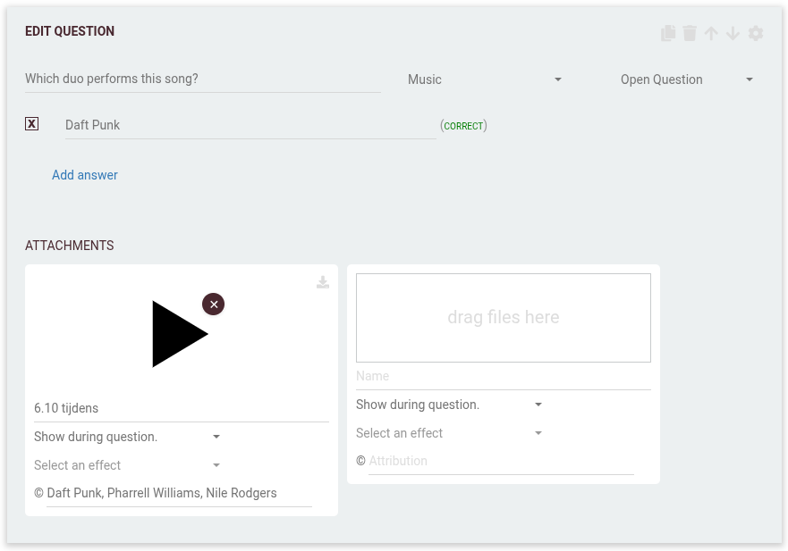

# Open question

An open question lets players type their answer freely using their keyboard. This mode is perfect for questions where you want written responses — for example, names, numbers, or short explanations.

---

---

## 📝 How it works

- **Question:** Ask for a specific answer in a freeform text field (example: “Which duo performs this song?”).
- **Answer:** Players type in their response. You can provide multiple accepted answers for automatic validation.
- **Attachments:** Add audio, images, or video as a clue (for example, play a music clip).
- **Feedback:** Players see after answering if their response was marked correct or not. You can also provide additional feedback or explanations.

---

## ⚙️ Expanded settings

Open questions offer a range of settings to fit your quiz:

- **Multiple accepted answers:** Add alternate spellings, abbreviations, or synonyms for more flexible auto-correction.
- **Time-based scoring:** Reward faster answers (see “Scoring” below).
- **Force automatic correction:** Enable this to let the game automatically mark correct answers based on your provided list.
    - If not enabled (the default for most live games), open answers must be reviewed and scored manually using the [Jury app](../../quizmaster/004-jury-app.md).

For more on these options, see [writing questions](../../editor/005-writing-questions.md).

---

## 🏆 Scoring for open questions

Scoring in open questions is designed to be fair, even for slower typers:

- **Time-based scoring** divides the available points into blocks, not a strict per-millisecond countdown.
- For example, answering in the first block (e.g. first 5 seconds) gives full points; the next block gives 80%, and so on. This helps reduce the penalty for slow typers.
- By default, only **25%** of the points depend on speed — the remaining **75%** is fixed, so everyone who answers correctly gets most of the points, regardless of typing speed.

> ⚙️ **Tip:** You can further adjust scoring behavior and other settings in the [Round options](../../editor/008-round-options.md).

---

## 🧑‍⚖️ Jury review in QuizWitz Live

In **QuizWitz Live**, open questions generally require a manual review with the [Jury app](../../quizmaster/004-jury-app.md):

- The Jury app lets jury members accept, reject, or adjust scoring for open answers.
- Phonetic and alternative matching helps, but human judgment is essential for fair scoring and creativity.
- For full instructions and features, see the [Jury app documentation](../../quizmaster/004-jury-app.md).

---

## 💡 Tips for great open questions

- **Be specific:** Tell players exactly what you want them to answer.
- **Anticipate variations:** Add common abbreviations, alternate spellings, or synonyms to accepted answers.
- **Use attachments:** Add audio, images, or video to make your question clearer or more engaging.
- **Coordinate with your jury:** Make sure your jury knows what to accept for subjective or tricky answers.

---

For more about attachments and feedback, see the [Attachments documentation](../../editor/006-attachments.md).
