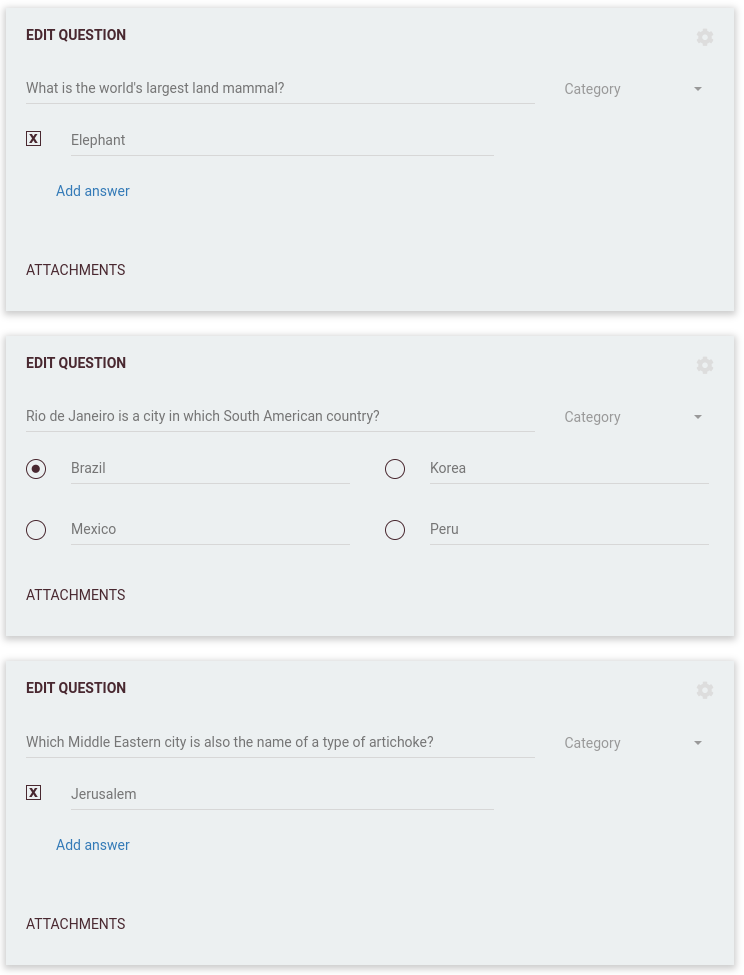

# 📝 Traditional

A **Traditional** round simulates the classic pub quiz format, where players can change their answers until the end of the round—just like handing in your answer sheet at the pub!

---

---

## 📝 How it works

- The round can include both multiple choice and open questions.
- As each question is asked, a new answer field appears on the player’s device.
- Players can **edit any of their answers** up until the round finishes.
- All answers are automatically submitted when the timer for the last question runs out.

---

---

## ⚙️ Settings & notes

- **No early finish:** The “Stop timer when everyone answered” setting is disabled in traditional rounds, since players can change their answers up to the end.
- **Best for teams:** This mode is perfect for teams or players who enjoy discussing and double-checking their answers.
- **Flexible content:** You can mix open and multiple choice questions as you see fit.

---

For more information about configuring round types and advanced settings, see [Round options](../../editor/008-round-options.md).
