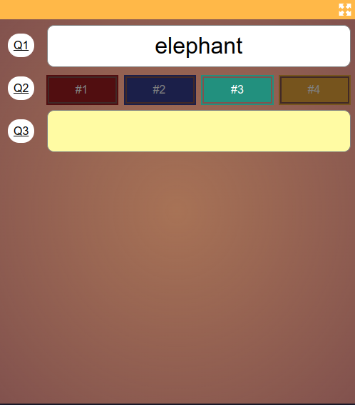

# Traditional - Common Thread
A traditional common thread round where players can change their answer until the end of the round. This round mode 
is identical to the [traditional round mode](030-traditional.md) with the only difference being that the last question
(traditionally 'what was the common thread in this round?') is evaluated first.

