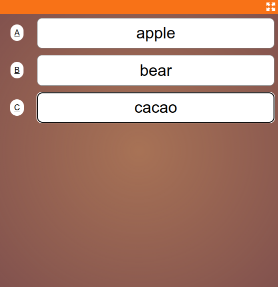
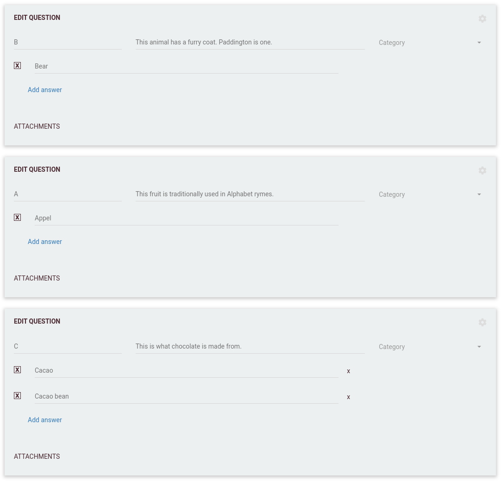

# Alphabet
Traditional round where each question has a unique label. Players need to match the right question to the right label.

## Alphabet labels
In Alphabet rounds each question is assigned a unique Label (traditionally this is the first letter of the answer, but
feel free to be creative). 

Similar to traditional rounds, players will get a list of fields for each question in the round and will be able to 
change their answers until the round finishes. Different from traditional rounds though, these fields are not in the 
same order as the questions in the quiz, but are instead ordered alphabetically based on the label of the question. 
The players will thus have to match the right question to the right answer field.

See above example: The order of the questions asked by the game will be: Bear, Apple, Cacao. The order of the answer 
fields on the player devices will be 'A, B, C' (alphabetical order). Players will thus have to know that the answer to 
the first question ('Bear') has to be written in the second field (with label 'B').

As the players can change their answer until the end of the round, they can switch the position of their answer if 
they realise they made a mistake, resulting in a thrilling round where every answer has to be carefully placed and moved.
