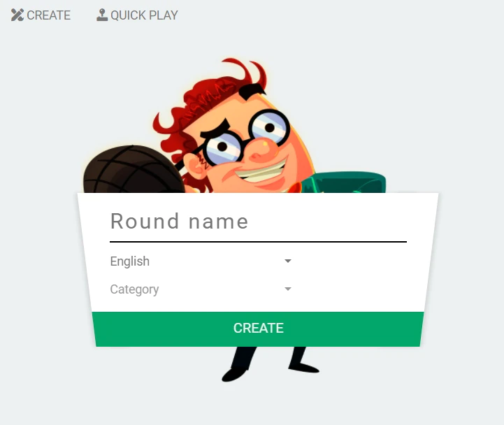
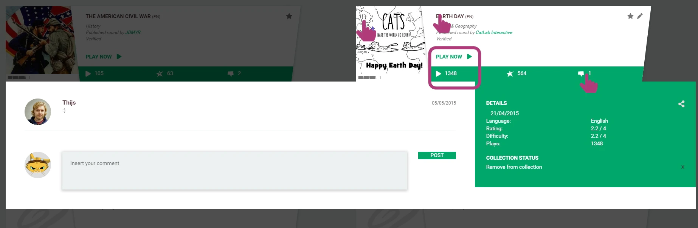

# 🧠 Create a Round-About

A **Round-About** is the core quiz unit in QuizWitz — a themed set of questions presented in random order. You can create your own and play privately, or publish it to share with the community.

---

## 🎬 Getting started

From the main menu:

1. Click **Create**
2. Select **Round-About** from the dropdown

---

## ✏️ Title, language & category

Start by giving your Round-About a clear:

- **Title** — something catchy or descriptive
- **Language** — the language your questions are written in
- **Category** — helps players find your Round-About later

> 🔒 You don't need to publish your Round-About to play it. Keep it private or publish it when you're ready to share.

---

## ➕ Adding questions

Click **Add new question** to begin creating your quiz content.

- Add as many questions as you like
- Save your progress frequently
- You can test and play your Round-About at any time

> 📢 **To publish your Round-About**, you’ll need **at least 14 questions**. Once published, it becomes visible to the entire QuizWitz community — but you can unpublish it later if needed.

Want to add questions in bulk? Use the **Import questions** feature and follow the prompts to format everything correctly.

> 🛠️ More details on question types and editing can be found in the upcoming chapters.

---

## ⚙️ Round-About settings

In the **Details** section, you’ll find additional configuration options:

- **Translate** — Create a translated version of your Round-About in another language
- **Category** — Choose or update your Round-About’s category
- **Round type** — Select how questions are presented to players. You can configure:
    - Multiple choice
    - Open questions
    - Lightning rounds
    - And more

> 🔗 Learn more about [round modes](../advanced/round-modes/round-modes) and [question modes](../advanced/question-modes/question-modes) in the advanced guides.

---

When you're happy with your content, hit publish — and share your Round-About with the world!
