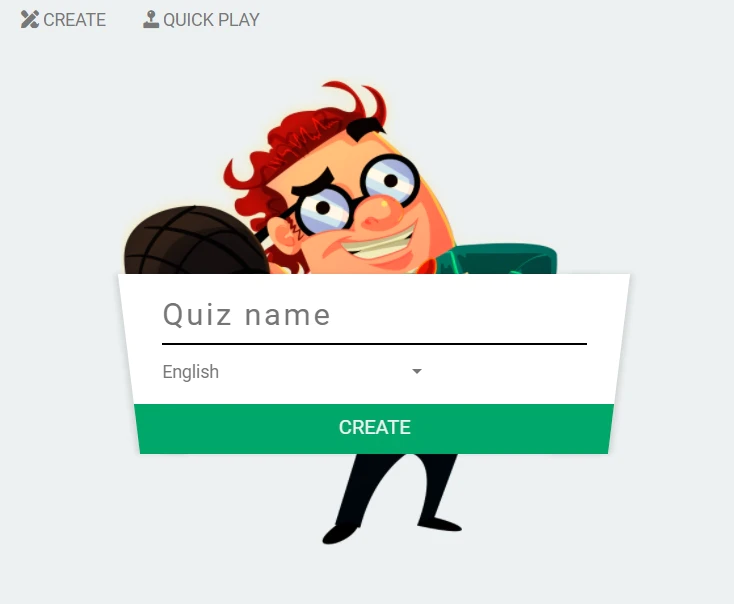
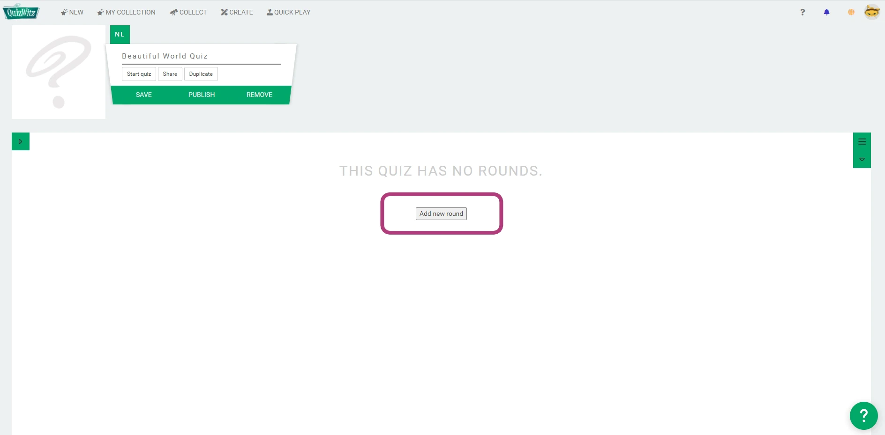
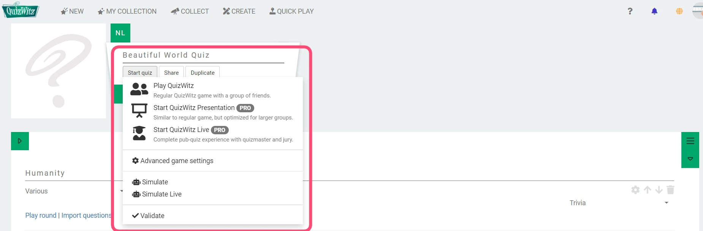

# Create a Full Quiz
So you want to create a Round-About for the community? Start on the main menu.
Choose a Create, and pick Quiz from the dropdown.

## Choose a title and language
Choose a title for your Quiz and select a language. Note that you can add additional languages / translations afterwards.

## Adding rounds and questions
Let's start quiz-making! 

First, you can add rounds by clicking Add new round. This will add one and give you the following options on the left hand side:

 * Set a name for the round.
 * Choose a category.
 * Import Questions. To know more, click on the link below.

In the main menu, you can...

* Save your work regularly.
* Test and play your quiz whenever you want!
* Publish your quiz when you are ready, if you want. You will need to add 14 or more questions to do this. Keep in mind this will make your Round-About available to all QuizWitz members.  You can unpublish them if you need to. Remember, you don't have to publish if you added personal questions.
* Remove a Quiz if you don't need it anymore.

You can use the arrows up & down to move Rounds and Questions. The trash bin icon can delete something for you.

If you want to add multiple questions at once, you can use the import questions option. 
Follow the instructions to add all the information in one go. Make sure to check if everything was imported as planned.

## Testing & playing

To test a quiz, press the 'Start Quiz' button. You will given the following options:
 * Play QuizWitz: Play a regular QuizWitz game
 * Start Quizwitz Presentation
 * Start QuizWitz PRO

Advanced game settings
 * **Simulate**:  simulate a play through of your quiz with bots. It will simulates player interactions.
 * **Simulate PRO**: simulate a play through of your quiz with Quizmaster and Jury screens and bots. 
   It will show you what happens on all possible sreens and simulates player interactions.

