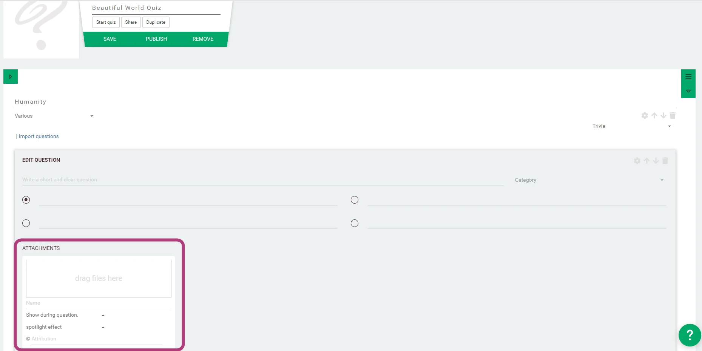

# Writing questions
Let's get the creativity flowing. You can add questions by clicking Add new question. You can add as many questions 
as you need. Don't forget these basic elements:
 * Save your work regularly.
 * Test and play your quiz whenever you want.

## Question options
Click the little gear icon on the top left to open the question settings.

### Mode & points:
 * Question mode: Choose between different settings for different game experiences.
 * Points: Decide how many points a player can earn with this question.
 * Multiply Question Time: Edit the time limit for this question by moving the time slider.
 
### Setting selection
 * **Time based scoring**: The scores are determined by how fast players respond.
 * **Multiple correct answers**: You can select more than one correct answer.
 * **Random answer order**: The system shuffles the answers in a random order.
 * **Stop timer when everyone answered**: The game continues when everyone answered. Uncheck to wait for the timer to run out showing the next step.
 * **Show question results**: Show feedback and results after the question, or uncheck to omit this step.
 * **Force showing question results immediately**: When unchecked, the question results are shown after the round, when selected, they will be shown after the question.
 
In the next section, you can add different texts to spice up the quiz experience:
 * **Big Screen - Question feedback**: This text will be shown on the big screen, after the question feedback has been revealed.
 * **Presenter - Long question**: This text is shown on the quiz host app. This text will be read by the host before players can answer.
 * **Presenter - Long feedback**: This text is shown on the quiz host app. It is to explain the feedback results.

You can close the screen with the 'x' mark. Your changes will be confirmed automatically, but don't forget to save the quiz.

### Attachments

Attachments that can be attached to the questions include:

* **Before, during, after question** This attachments will be centered around the question, 
    being shown while players are answering, immediately before or after the question.
* **Before, during, after feedback** This shows the attachment right before you are about to reveal the correct answer, 
    during the results showing, or after showing the results.

It is important to note that the question feedback (result) is not always shown immediately after the question has been 
answered - in case of open questions for example, which require time to judge. So choose these settings 
wisely for extra dramatic effect.

You can add multiple attachments. When you are hosting a PRO Quiz, you can add multiple ones in each slot and the 
quizmaster will be able to select which ones to show first. In regular games, all attachments are shown at the same time.

#### Pro Tip (when to show attachments)
If you want to reveal the correct answer with an image immediately, choose 'after question'. If you want to reveal 
the correct answer right before showing the question results, add the attachment 'before feedback'. 
If you want your attachment to be a way to show extra info about an answer, choose 'after feedback'.

