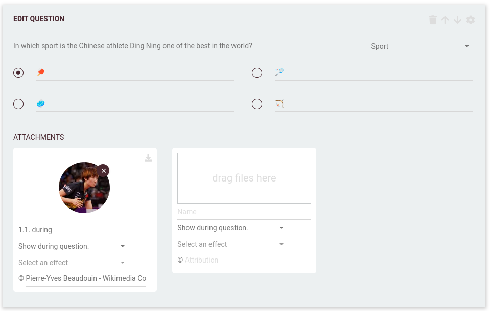

# Attachments

Attachments can be added in multiple slots during the quiz.

These slots are defined in following entities:
 * [questions](005-writing-questions.md)
 * [rounds](008-round-options.md)
 * [quizzes](007-quiz-options.md)

When these slots are displayed is shown in the above pages.

## Types
Non-exhaustive list of compatible types:
- Images: png, jpeg, gif (non animated). Images in full HD (1920x1080) will work best.
- Audio: most audio formats are supported
- Video: most video formats are supported

Audio and video attachment cannot be longer than 15 minutes.

## Name and attribution
It is always a good idea to name each attachment, and fill any applicable attribution. The attribution will be displayed
within the game, while the name will be visible to the Quizmaster in PRO games. Choosing a good name will help the
quizmaster remember when to show or hide the attachment.

## Attachment effects:
In some slots you will be able to add an 'effect' to the attachment you have uploaded. This effect will distort the 
attachment in a way that when display starts, the image is completely indistinguishable while, over time, it gets more clear.

 * None: the image/audio/video is presented as is
 * Spotlight effect: This can be used to gradually reveal an image. A spotlight will bounce off the frame of the image
   to reveal parts of the image. The spotlight will become larger to gradually show complete image.

## Multiple attachments in the same slot
In some slots it is possible to add multiple attachments. The behaviour of these multiple attachments depends on the 
game mode (regular or PRO) and the slot itself. Specifics of each slot are described in the documentation of each 
individual entity, but in general the different behaviours can be described as:
 * In regular games, the multiple attachments are shown at the same time
 * In PRO games, the quizmaster gets control over the attachments and can show/hide them as they please.

