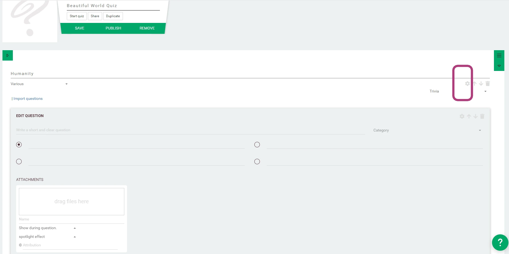
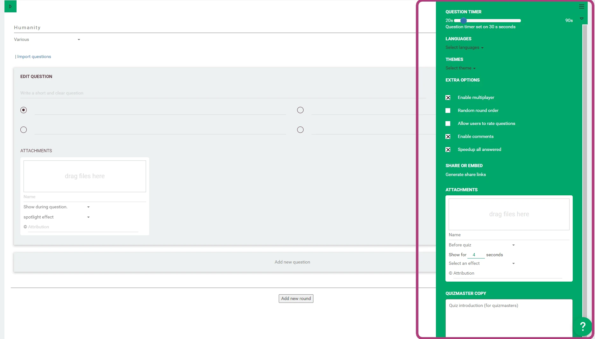

# Quiz Options
When creating a quiz you can open the Quiz settings to alter the game behaviour.
These options will affect the complete quiz!

The quiz options menu will slide open:

## Question timer
This will set the max. time for all questions in the quiz. Open questions will receive double the time by default.

This is set on 30 seconds by default, but we recommend 20 seconds for online live streamed quizzes.
You can edit the time factor on the level of the individual questions.

## Languages
Here, you can select which language the questions will be created in.

## Themes
Select the theme you want to display. This changes the design for your quiz. The standard theme is named 'QuizWitz'.
Your profile or organization may have access to multiple themes.

## Attachments
Attachments that can be attached to the quiz include:

 * **Before quiz** is shown/played when the quiz starts
 * **After quiz** is shown/played after the game has finished (after the player ranking screen)
 * **Client Logo** & (alternative): any image uploaded here will be displayed in the game in the 'client logo' container
 * **Wait Screen**: in live games this attachment is shown in between questions. Use an image of 1920x1080 size
 * **Background**: in some themes this attachment allows you to replace the background of the design
 * **Connect Screen**: this slot is only in use in 'conference' and 'live' modes. It contains attachments that are shown/displayed
   during the connect phase of the game (while players are connecting to the game, before the game actually starts) and
   each attachment type has a different use:
   * **Images** will be displayed in full, this way you can alter how the connect screen looks.
   * **Audio** will be played in a loop. You can upload up to 15 minutes of music that will be played while the players are connecting.
   * **Video** will be played every 5 minutes. This way you can upload an instruction video or ads to be displayed before the quiz.
     We have prepared a few example [instructional videos](https://drive.google.com/drive/folders/1-KgABfLJ7cblm0aqxb7niMdGmTd3UXZC) 
     for you to use.
 * **During game outro** (audio only) can be used to replace the music that is played during the game outro (= winner reveal)
 
## Extra options
These options can be checked for use on the complete quiz:

* **Enable multiplayer**: whether you want to play with friends or not. This is checked standard.
* **Random round order**: This randomizes the order in which the rounds are shown. (do not select this when creating a quiz for a quiz host)
* **Allow users to rate questions**: This will allow players to rate your questions after each round. Only select this when necessary, as it slows down the pacing of your play through.
* **Enable comments**: Allow QuizWitz members to comment on your quiz after publishing.
* **Speedup all answered**: When selected, the game continues when everyone answered a question. 
    Deselect to wait for the timer to run out. Tip: if you work with Time based scoring, keep this option selected.

## Share or embed
Share or embed generates sharing links with Advanced Game Settings.

## Quizmaster copy
Here you can add texts and instructions for the Presenter that will be displayed on the Quizmaster tablet.
Note the option to add info for the introduction and the quiz ending.
