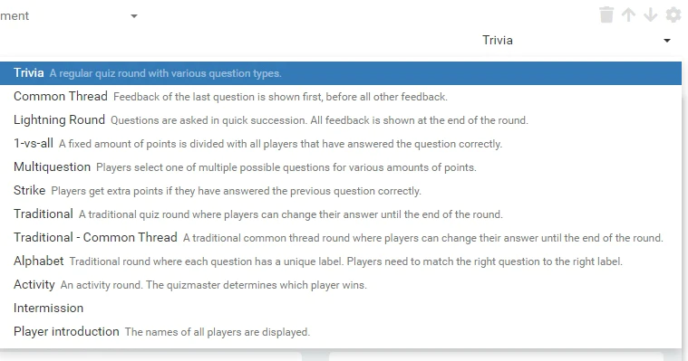
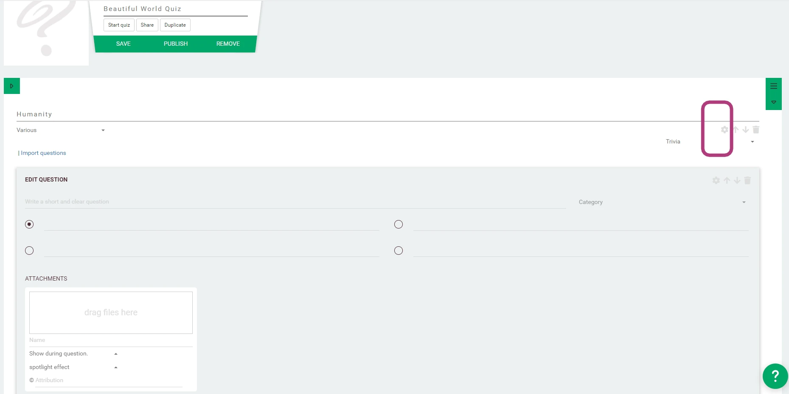
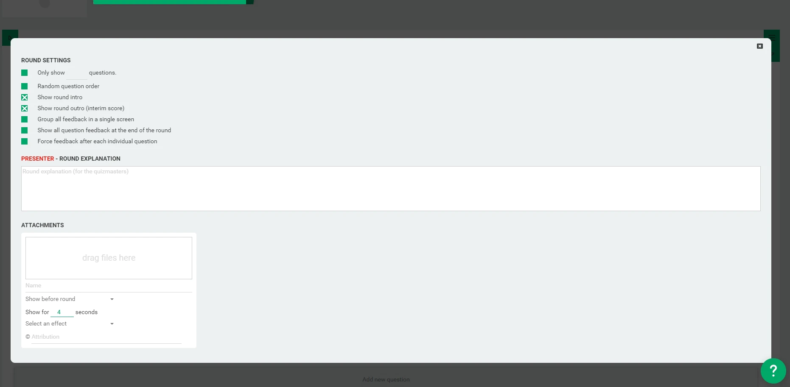

# Round options
Each round has a specific type. Choose one per round. The standard is Multiple Choice (Trivia). 
Feel free to test and try them all. In 'Round options' we list all special options for each round type.

Click the 'gear' icon to open the round options:

Following options are applicable to most content types:

 * **Only show __ questions**: Show only a certain amount of questions out of the complete set.
 * **Random question order**: This randomizes the order in which the questions are shown.
 * **Show round intro**: Show an animation and the round title before the round starts.
 * **Show round outro (interim score)**: Show the rankings after this round.
 * **Group all feedback in a single screen**: force the question feedbacks/results to be shown in one screen after the round has ended.
 * **Show all question feedback at the end of the round**: This setting makes the game postpone the presentation of the question feedbacks/results until after the last question has been answered.
 * **Force feedback after each individual question**: This makes sure the question feedback/result is shown immediately after each question, which means that for an open question, you'll have to wait to continue until it has been judged.

Next, you can add some text and directions for the quiz host. It will only be shown on the quizmaster's screen at the start of the round.

## Attachments
Attachments that can be attached to the quiz include:

* **Before round** is shown/played right after the round intro
* **After round** is shown/played after the round outro
* **Before round outro** is shown/played after the last question
* **During round outro**: (audio only) is played during the round outro

