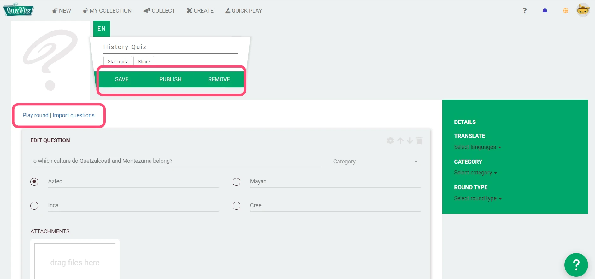
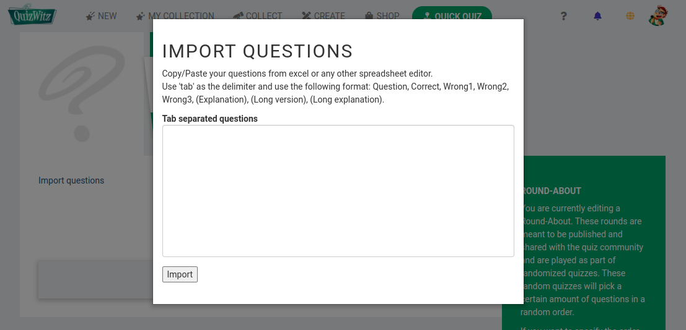

# Import questions

You can import questions from Excel and other spreadsheet software by clicking the 'import' button on top of any round.

Make sure that you follow this order of columns when copy-pasting from excel:

  1. Short question (for display)
  2. Correct answer (or correct multiple choice option)
  3. Wrong multiple choice option 1 (leave blank for open questions)
  4. Wrong multiple choice option 2 (leave blank for open questions)
  5. Wrong multiple choice option 3 (leave blank for open questions)
  6. Short explanation of the answer (for display)
  7. Long question (for display on the quizmaster tablet)
  8. Long explanation of the answer (for display on the quizmaster tablet)

Now click Import and your questions should be automatically created in your round.
