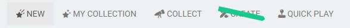
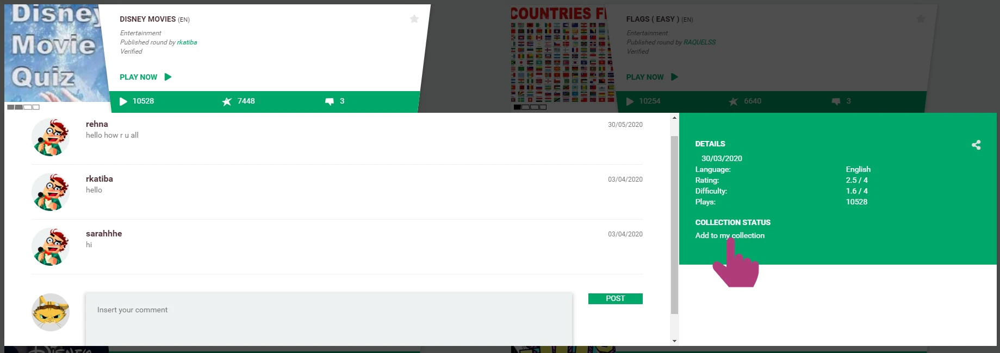
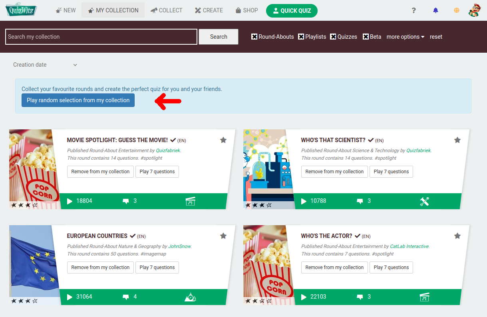
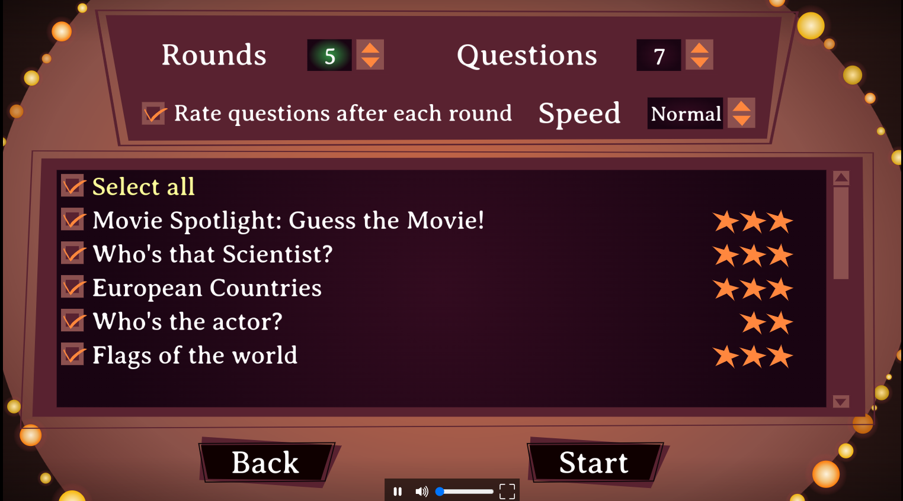
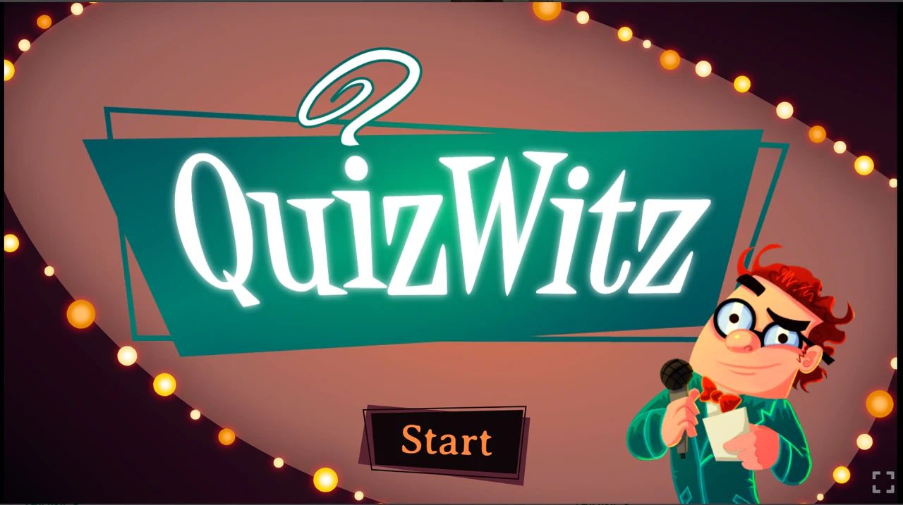
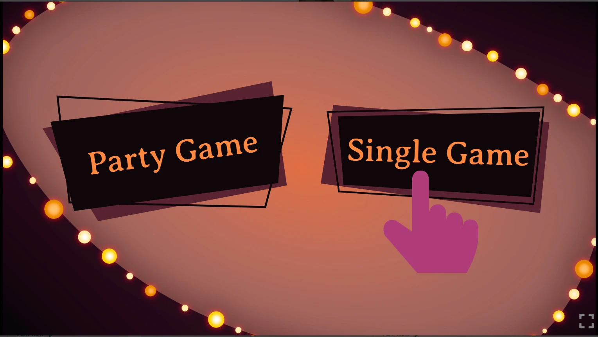
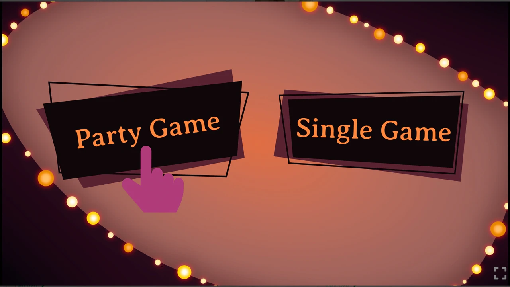
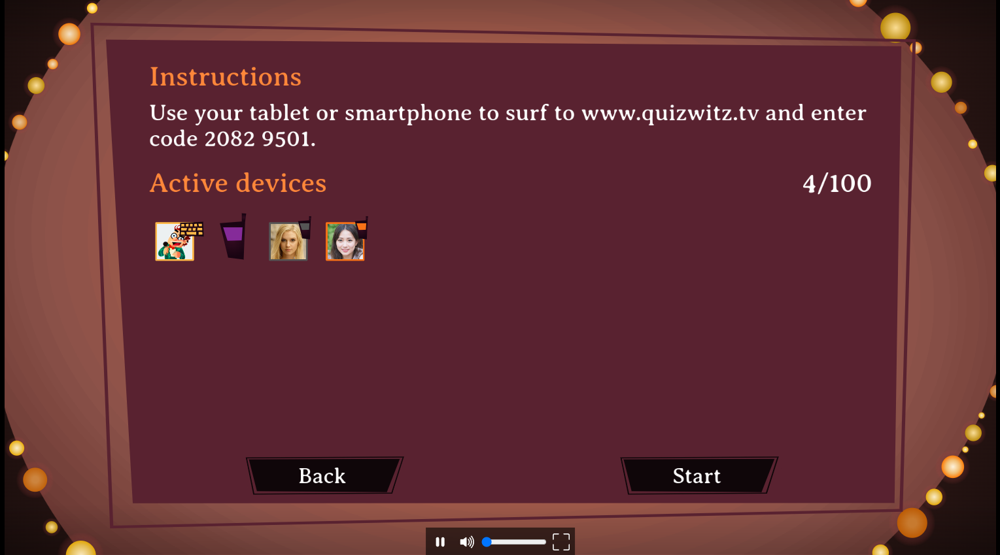
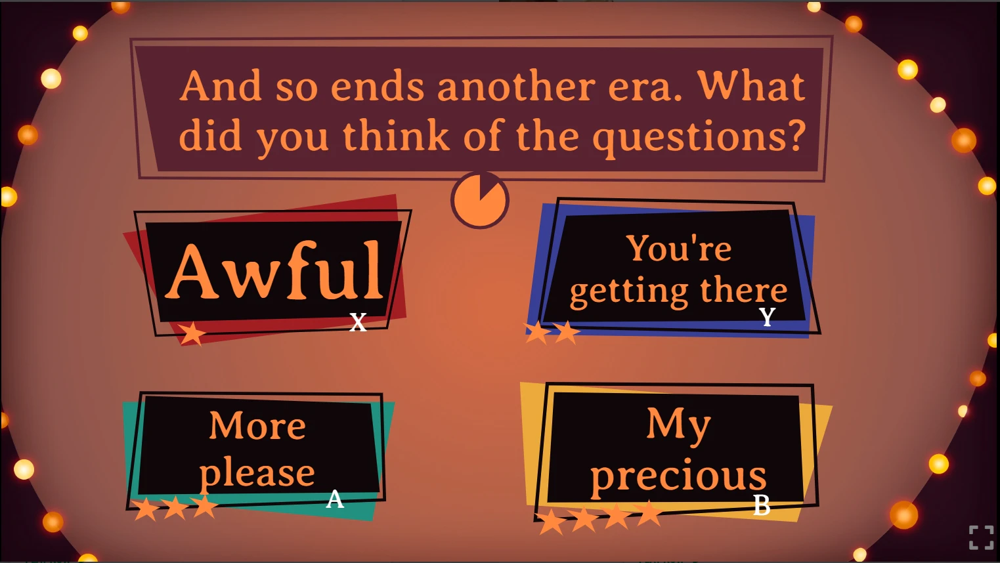

# 🧠 Playing QuizWitz

Welcome to QuizWitz! Whether you're playing solo or with friends, this guide will help you get started.

---

## 🎯 Choose what to play

Start by browsing the available **Round-Abouts** — short themed rounds of quiz questions. Use the menu at the top of the screen to explore:

- **New** — Discover the latest Round-Abouts
- **My Collection** — Access everything you've saved or created
- **Collect** — Find Round-Abouts made by the community
- **Quick Play** — Jump into a random selection

> 💡 **Tip:** Want to play everything you’ve collected? Click **My Collection**, then hit **Play my collection**!

---

## 📚 What's in My Collection?

**My Collection** includes all the quiz content you’ve either:

- Created yourself
- Collected from other creators

This includes:

- Round-Abouts
- Full quizzes
- Playlists
- Bingos
- ...

You can organize, play, or remove items at any time. This is your personal library — build it how you like!

---

## 🧠 Choose a Round-About

A **Round-About** is a small, themed round of questions. Playing just one will give you a short game with 7 random questions.

To explore a Round-About in more detail:

- Click its **image**, **title**, or **comments icon**
- Click **Play** to jump in immediately

---

## ⭐ Add Round-Abouts to your collection

Want to build a full quiz game from multiple Round-Abouts? Here's how:

- Click **Add to my collection** inside the Round-About
- Or click the **star icon** on the Round-About tile

To remove one later, just click the star again — it’ll now say **Remove from my collection**.

---

## ▶️ Play your collection

When you're ready:

1. Click **My Collection**
2. Press **Play my collection**

Choose:

- **Game mode** — Single Player or Party Game
- **Which Round-Abouts** to include in your session

QuizWitz will try to skip questions you've already seen.

---

## 🕹️ In-game experience

Once your game starts, choose your mode:

### 🎮 Single Player

- Click **Start**, then choose **Single Player**
- Use your mouse, keyboard, or touchscreen to answer

  

---

### 🎉 Party Game

Play with friends using their own phones or tablets:

> 📺 Make sure the quiz screen is visible — use a shared display or screen share

1. Click **Start**, then **Party Game**
2. Players follow the instructions on-screen to join
3. Click **Start quiz** when everyone is ready

  
  

---

## ⭐ After the game

At the end, rate the Round-Abouts you played. This helps surface great content and supports creators.

---

Enjoy the quiz, and may the best brain win! 🧠🎉
