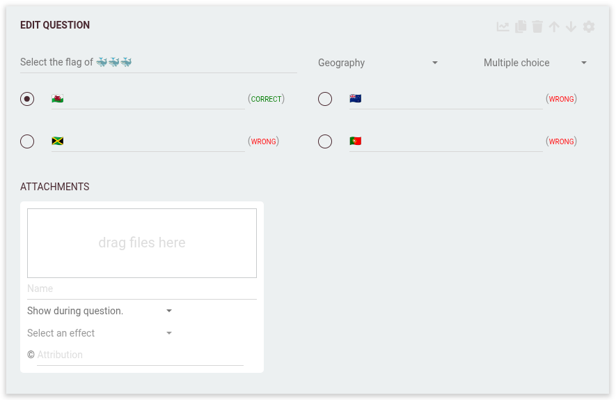

# 🔢 Multiple choice

A regular multiple choice question lets players select the correct answer from several given options.

---

---

## 📝 How it works

- **Question:** State clearly what players should answer (example: “Select the flag of 🐟🐟🐟”).
- **Options:** You can provide up to four answer options.
- **Correct/Wrong:** Mark one or more correct answers, depending on your settings.
- **Feedback:** Players see which answer was correct after answering. Optionally, you can provide extra feedback or explanations.

---

## 🏆 Scoring

Multiple choice questions use **time-based scoring** by default: faster answers earn more points. For these questions, scoring decreases continuously per microsecond, with most points fixed and only a portion influenced by speed.  
**You can also turn off time-based scoring per question** if you want all correct answers to receive the same score.  
You can further adjust this balance in the round settings.

See [Scoring options in round settings](../editor/008-round-options.md#-scoring-options) for full details.

---

## ⚙️ Expanded settings

The Multiple choice question type offers many settings to fine-tune the experience and scoring.  
See [writing questions](../editor/005-writing-questions.md) for a general overview of question settings.

---

## 💡 Tips for great multiple choice questions

- **Be clear and concise:** Avoid ambiguous wording.
- **Use plausible wrong answers:** Make distractors believable.
- **Mix media:** Add images, flags, or sounds for engagement.
- **Randomize order:** Keep things fair for all players.
- **Tag and categorize:** For easy navigation and searchability.
