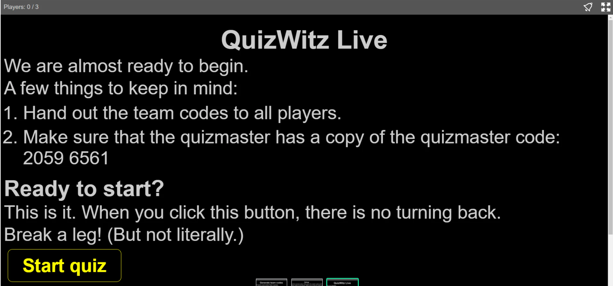

## Hosting a quiz with QuizWitz PRO

To be a true quizmaster, you should use our Quizmaster App. Our game mode 'QuizWitz PRO' can be launched from
the quiz editor. Click ‘Start QuizWitz PRO’.

## Start with the Master Code

Once started, the main screen will open and you can press 'start'. Be sure to never show the Master Code
to your audience! It is the code used for the quizmaster to connect their smart device.

Surf to quizwitz.tv and enter the Master Code on the device that you’ll want to use for the presentation.
The Quizmaster App Page will open. For the quizmaster's device we suggest something portable, like a tablet or
smartphone, so the quizmaster can easily move around during their presentation. A laptop is possible if you have a desk
or table, but having something to hold helps you to interact better with the audience rather than looking at your touchpad.

When the Master Code is no longer shown. Now you are ready to show the game on the big screen or start the livestream.

Now you will have to select which game mode you want to use:

## Choosing you desired game mode

There are two modes in the PRO game: 'Team codes' and 'Single game code'.

 * **Team codes**: Start a quiz event in which each smart device has its own unique Team Code. The quizmaster first
   has to reserve Team Codes, one for each smart device. Make sure you possess the team/player names upfront. This mode
   is especially handy when presenting a quiz for teams, as each unique code can be opened on multiple devices, so teams
   can switch from one device to another should their battery run out.
 * **Single game code**: Allow players to join using one Game Code for everyone, In this mode, there is no need
   to pre-register and players can join whenever they want using the Game code. Click ‘Single Game Code’
   to continue and let things load up!

You must also login to make sure you will have access to the quiz.

### Hosting a QuizWitz Live game using Team codes
When the quiz has been loaded in, you will be able to add the amount of teams and their names in the Quizmaster App.

Then, press 'generate codes' and the game will generate the Team Codes for the players to use.
You can also reserve codes upfront, but more on that in the tips & tricks section later!

Don’t forget to write down/save/remember the Master Code, the Jury Code and the Regie code!

Get the codes to your players. Either by handing out a page or via e-mail. Press 'load quiz' and wait for the quiz
game assets to load in. Press ‘start’ and confirm your selection.

### Hosting a QuizWitz Live game using a Single game code
When the quiz has loaded, the codes for the quiz crew and one Game Code for the players will show up on the quizmaster app.
Don’t forget to write down/save/remember the Master Code, the Jury Code and the Regie code!

Your main screen will now show the Connect screen for the players.
This is the screen that you should show/stream to your players.

When you have reached the desired amount of players, you can press 'load quiz' and in the next screen ‘start quiz’
plus confirm your selection. The Game Code will remain visible on the main screen throughout the quiz.
This way, players can keep joining until all the active seats in your account have been filled up.

## Seats

After selecting your desired game mode, you will see an overview of your active seats at this point in time.
You can activate more at app.quizwitz.com/seats. 

## Start the game

After the setup, the game will start and wait for the quizmaster to start the game.

