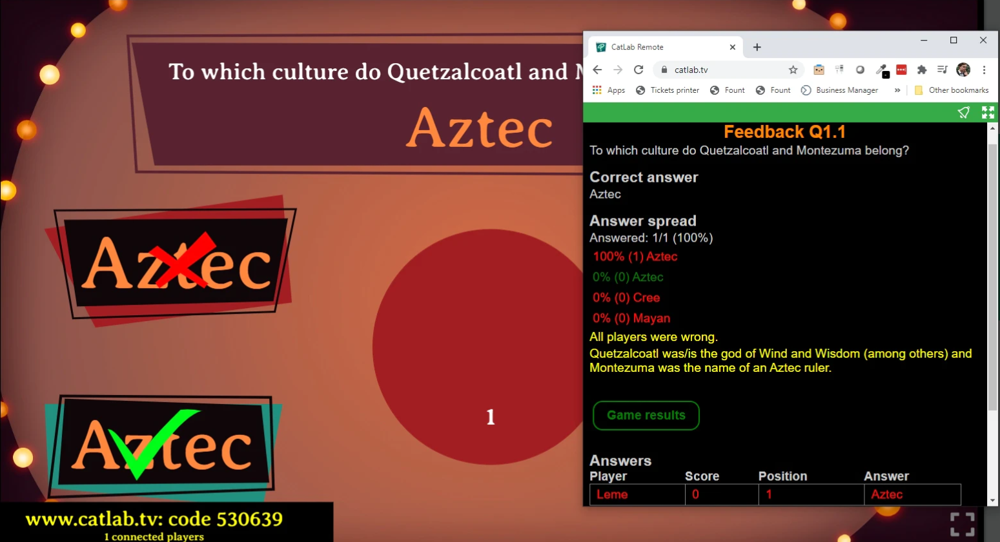

## Using the Quizmaster APP

As quizmaster, it's your responsibility to control the QuizWitz Live Game. The most important thing you need to 
know is that the game does not continue unless you click to do so. So nothing happens on the main screen if you don't 
click. This means you'll be clicking a lot! However, this gives you full control all along the way.

The flow of the quiz depends on the structure of the quiz in the editor, but the flow will to some extend follow the 
structure below:

### Round introduction
Before each rond the quizmaster gets an introduction screen of that specific round. The quizmaster is also in control 
of playing the introduction animation. Click 'Start' to start the round and go to the first quesiton.

### Asking a question
For each question in the game, the quizmaster will see a separate view on their device. This screen will contain:

 * **Question number**: The number of the question within the round and within the quiz. (1.1 = first question of the first round)
 * **Question type** what type of question and applicable scoring factors
 * **Long question**: If provided, this will contain the long version of the question to be read out loud.
 * **More information** about the question, including the duration of the timer, amount of points that can be scored, etc
 * **The short question** that will be displayed on the big screen
 * **Start question button** will immediately start the question timer
 * **The possible answers** (for multiple choice) in the order they will be shown on the screen

The question will remain on your Quizmaster App until everyone answered or the timer runs out.

For more information about Question and Round Types, follow the Quizmakers Guide.

### Question feedback
After a question, the correct answer will be revealed by the quizmaster. For this example we have selected a 
Multiple Choice question, but depending on the question type this screen will look slightly different. More information 
on these question types can be found in the Quizmakers guide.

 * **Question number**: The number of the question within the round and within the quiz
 * **The short question** that will be displayed on the big screen
 * **The correct answer**
 * **The answer spread** (in absolute numbers and percentages)
 * **Long feedback** about the correct answer to read out loud
 * **A continue button** to go to the next question
 * **Answers** of the quickest 100 players

### Round Outro
When a round is finished, you will be able to summon the Round Outro. 
On the main screen, this shows the players the ranking of the moment.

On the Quizmaster App, the quizmaster will be able to see the first 100 player ranking and scroll through it. By 
clicking on the numbers, they can highlight that location in the ranking on the main screen.

Starting from the second round, the presenter will also see how many places the players have jumped. 
Green for 'up', red for 'down', and just white for stable scoring. The number marks the amount of places gained/lost.

The players themselves will be shown their own position on their device during this outro.

### The end of the quiz
At the very end of the quiz, there's a reveal party. The game will show the winners and throw around the players' 
emojis all over the screen! Congratulations! (You shouldn't have picked the smiling turd!)

Standard, the top 12 will be shown (unless there are less players of course). The quizmaster can change the amount 
of players that will be shown in the advanced game settings.

