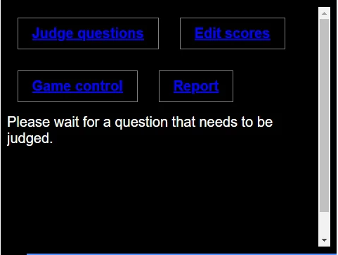
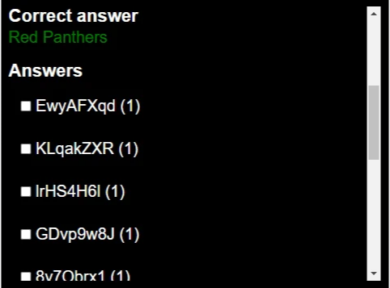

# Jury App
If your quiz has Open questions, you must use the Jury app to manually correct the open answers.

## Using the Jury App
The jury app can be opened by using its own jury code. This code will be generated at the start of the quiz. 
Just open a new browser and surf again to catlab.tv and enter the jury code.

On the Jury App Page, there are several neat tools to be found:
 * **Judge Questions**: the results of an open question will pop up once one is finished. When the jury has judged them, 
   those results will be shown after the next question. This means that the game will not wait unless it is the last 
   question in its round or the settings differ.
 * **Edit scores**: this allows you to grant or revoke points to players/teams.
 * **Game control**: this allows you to change the question duration during the game as well as setting a delay for 
   streaming. More about this via: http://catlab.be/2020/04/14/how-to-host-a-quizwitz-livestream-on-youtube/
 * **Report**: This selection allows you to generate a report which you can use to follow up the results and answers.

## Judging questions
After any open question, the jury app will show all player answers. The jury must now carefully tick the checkbox of 
all correct answers and click 'confirm'

The game will automatically select the perfectly correct answers. You can then start selecting the other correct 
answers. In its development, QuizWitz was programmed to abide by the rule: the answer must be correct phonetically.
But it's up to the judges to decide on a strategy.

