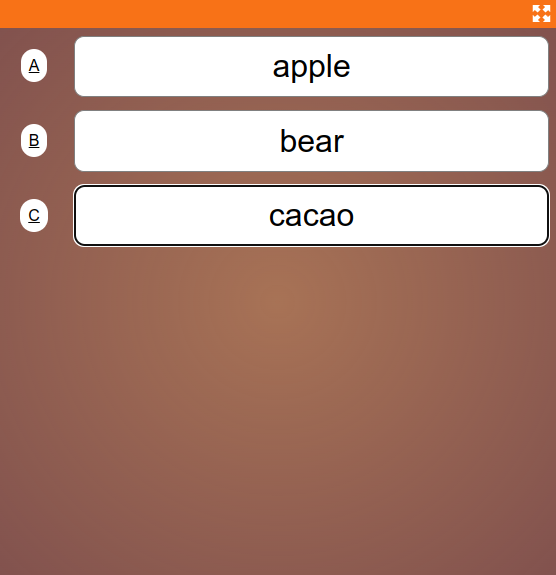
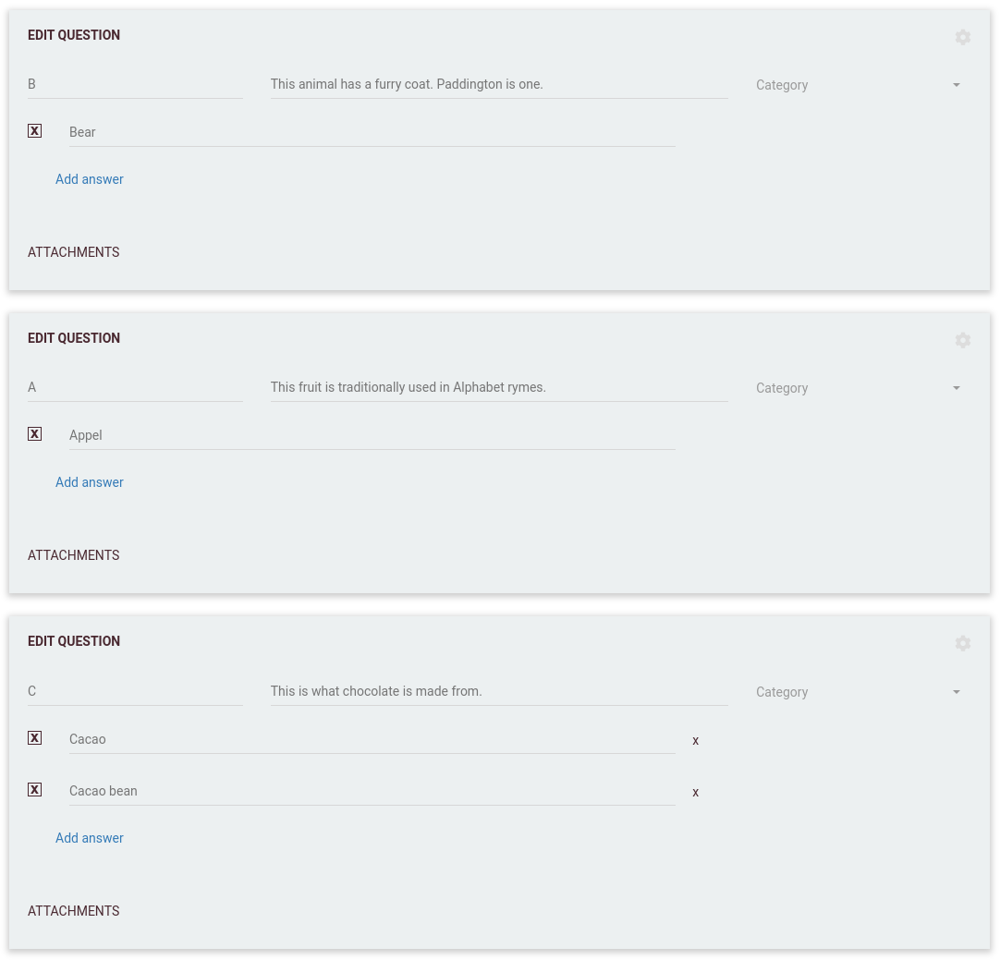

# 🔤 Alphabet

An **Alphabet** round is a traditional style round with a twist—each question is assigned a unique label, and players must match their answers to the correct labeled fields. This round rewards both knowledge and deduction!

---

---

## 🏷️ Alphabet labels

- Each question is assigned a unique **Label**. Traditionally, this is the **first letter of the answer**, but you can use any label you like (letters, numbers, or creative codes).
- **All questions must be open questions** in this round type.

---

---

## 📝 How it works

- As questions are asked, players see a list of answer fields—one for each question.
- **The answer fields are not in quiz order**—instead, they’re sorted alphabetically by label.
- Players must match their answers to the correct labeled fields (e.g. answer for question "Bear" must be entered under label "B").
- Answers can be changed at any time until the round finishes—players can switch answers between fields as they realize their mistakes.

---

> This round is especially fun and challenging, as it requires both knowledge and the ability to deduce which answer fits which label. Perfect for seasoned quizzers and creative rounds!

---

For shared configuration details, see [Traditional round](030-traditional.md) and [Round options](../editor/008-round-options.md).
