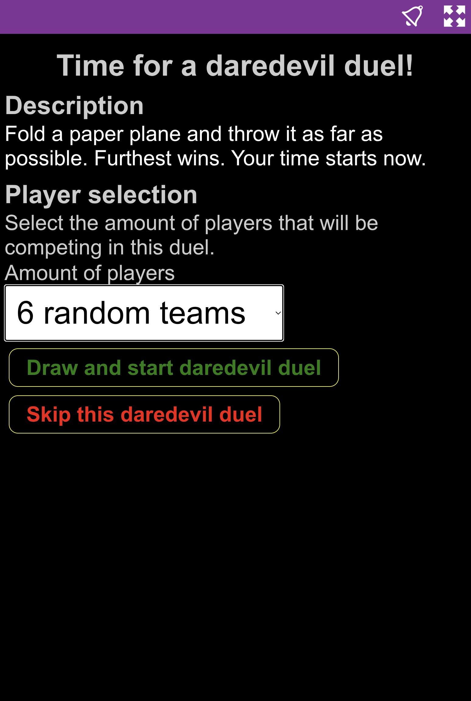
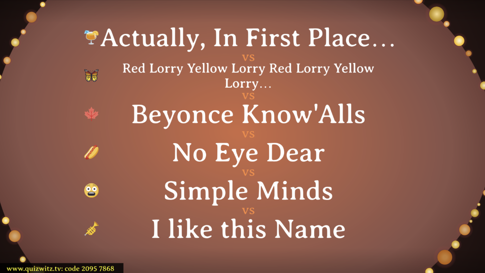
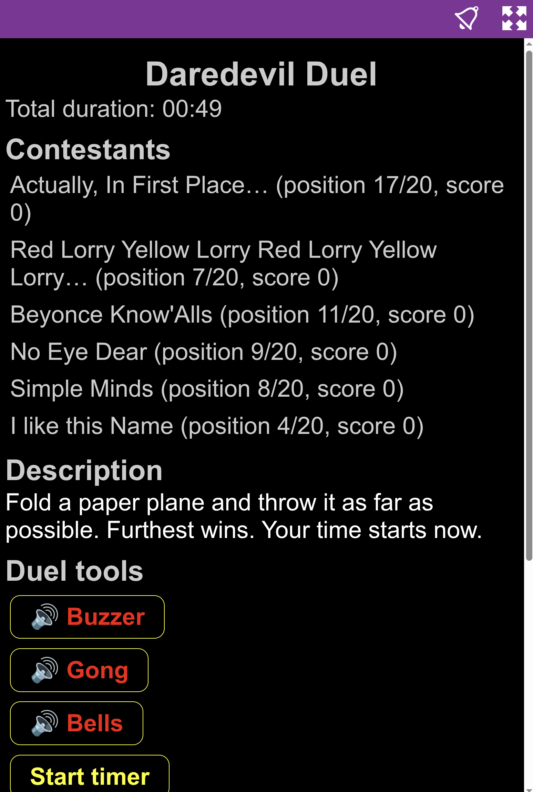
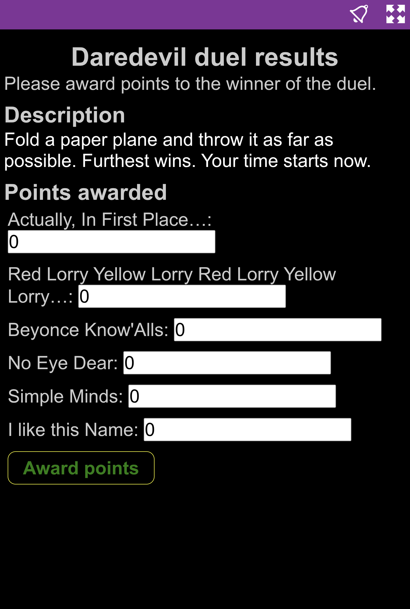
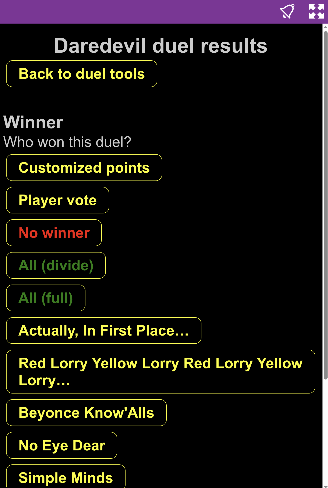

# 🎭 Activity

An Activity round lets you step away from standard quiz questions for a creative or physical challenge. The quizmaster describes an activity or duel, selects teams to compete, and awards points based on performance.

---

---

## 🏆 How it works

- **Challenge Description:** The round begins with a description of the activity (e.g., “Fold a paper plane and throw it as far as possible. Furthest wins!”).
- **Team/Player Selection:** The quizmaster selects which teams or players will participate in the activity.
  - **Random selection ensures every team is drawn an equal number of times throughout the quiz.**
- **Timer & Tools:** Start a timer and use sound effects (like buzzer or bells) to manage the challenge.
- **Award Points:** After the activity, the quizmaster enters the results and awards points to the winning team(s).

---

---

## 🛠️ Tools & Controls

- **Duel tools:** The quizmaster can access quick actions for buzzer, gong, bells, and timers during the activity.
- **Custom Points:** Points can be entered manually for each team, or you can select a winner with quick action buttons.

<table>
  <tr>
    <td markdown>
      
    </td>
    <td markdown>
      
    </td>
  </tr>
</table>

---

## 🏅 Deciding the Winner

- **Winner Selection:** Choose the winner(s) or divide points among several teams.
- **Player Vote:** Let players vote for the winner if you like.
- **Award Points:** Points can be divided or awarded as you see fit.

---

## 💡 Tips

- **Make it memorable:** Activities work best when they're fun for everyone to watch or participate in.
- **Be clear:** Announce the rules and expectations before starting.
- **Energize your event:** Use activity rounds to keep things lively and engaging.

---

The Activity round is perfect for interactive challenges, duels, or creative tasks — a great way to add energy and variety to your QuizWitz event!
