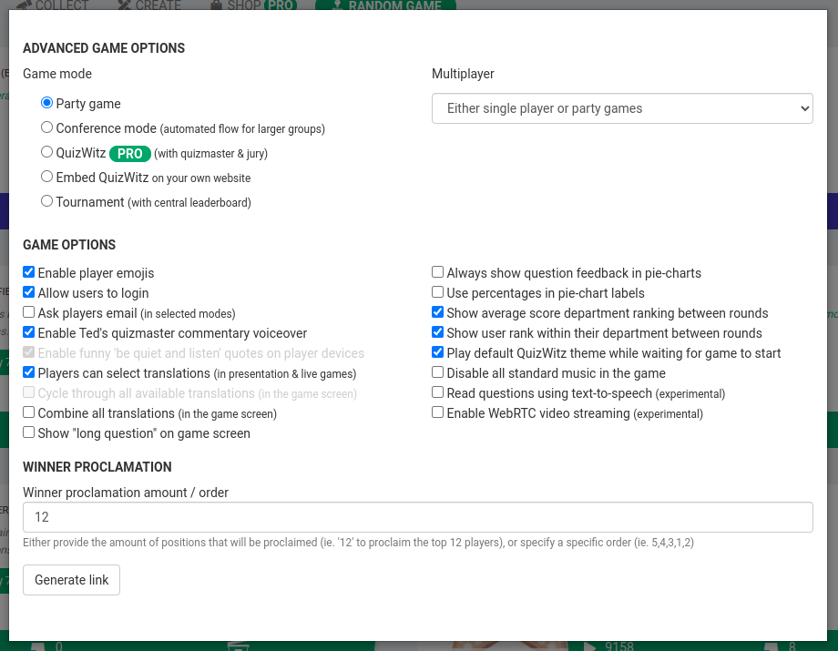

This tutorial will show you how to use QuizWitz at a conference booth.

## Creating the Quiz
When creating a quiz for a conference booth, it is good to keep in mind that some players will stick around for a 
couple of games. That is why it is important to make sure you have enough content to entertain players, ie: enough 
questions that are randomly selected to make sure that every game is unique.

In our experience, a game of 15 questions split up in 3 rounds is ideal for conference booths. To have some variety in 
the questions, you should provide 3 times that; but preferably even more.

### Create the Quiz
* Choose 'Quiz' in the 'Create' model and give your quiz a name. Make sure that the language is set correctly
* Create 3 rounds and give them a name (ie: Round 1, Round 2, Round 3)
* In the 'Round settings' (little cog icon on the right), set the 'Only show x questions' flag and set the amount of 
questions to 5. Also set the 'Random question order' flag, otherwise the game will always select the first 5 questions.
Repeat this for every round in the quiz.

* Now start [adding questions to each round](/docs/editor/writing-questions).
(Note that you can use the 'Import' button to copy-paste content form excel.)

:::tip
Use lots of images and video fragments! 
It really makes the game more entertaining.
:::

### Random question selection
Every time the quiz runs, the game will now select 5 questions from each round. The game will make sure that the 
questions are distributed equally, so that questions are not repeated too soon.

## Launch the Quiz
The easiest way to launch the quiz now is to click 'Play quiz' and select 'Start Conference Mode'. This will start the 
game in the default conference mode: players connect their phones to the website displayed on the screen; the booth 
host presses Enter when everyone is ready and the game players automatically. Once the game is over, the host presses 
enter again and the game goes back to the connecting stage.

### Advanced game options
If you want to make a few more tweaks to how the game works, you can select 'Advanced game options' and select 
'Conference mode' in the selectbox at the top. The system will then create a unique link that contains all options 
you have selected.

An especially interesting option is the 'Ask players email' checkbox, as this can be used to collect the email address 
of your booth visitors. Please do make sure to set a 'Privacy Policy URL' when selecting 'Ask players email'.  

Launching a game through the 'Advanced game options' URL is pretty much the same as starting it from the editor, 
except that you will have to Login at the start of the first game, to get access to your content and check your licenses.

## Theming
Please follow our [Theming guide](/docs/advanced/theming) to change how the game looks.
