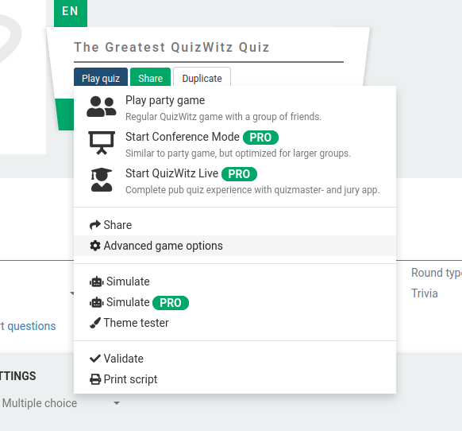
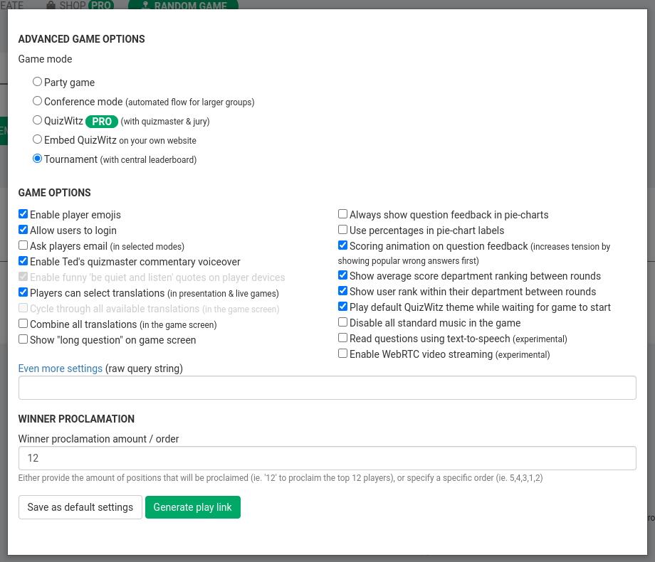
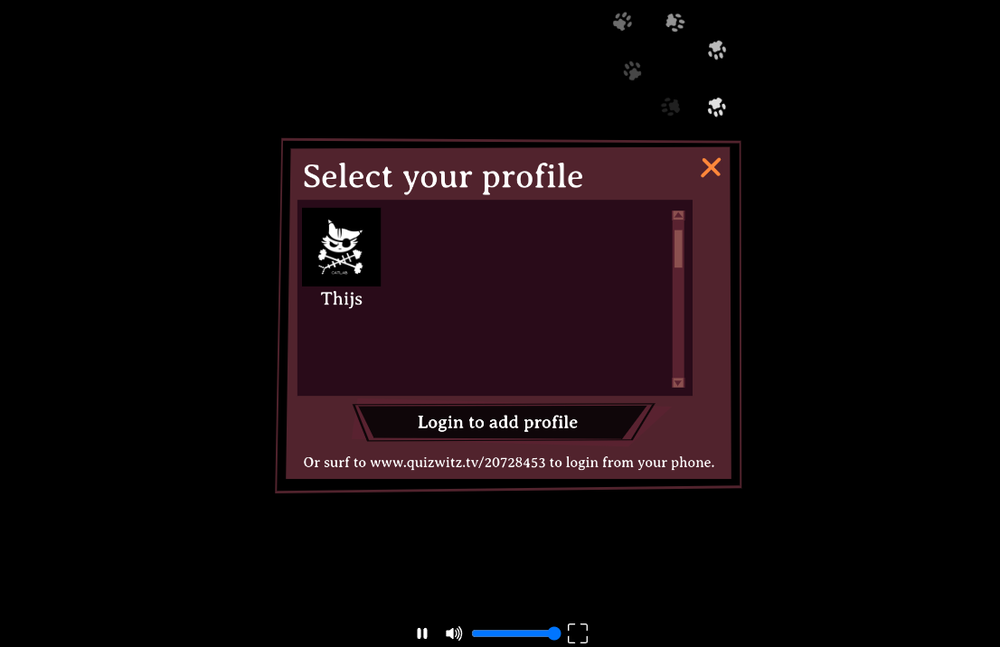
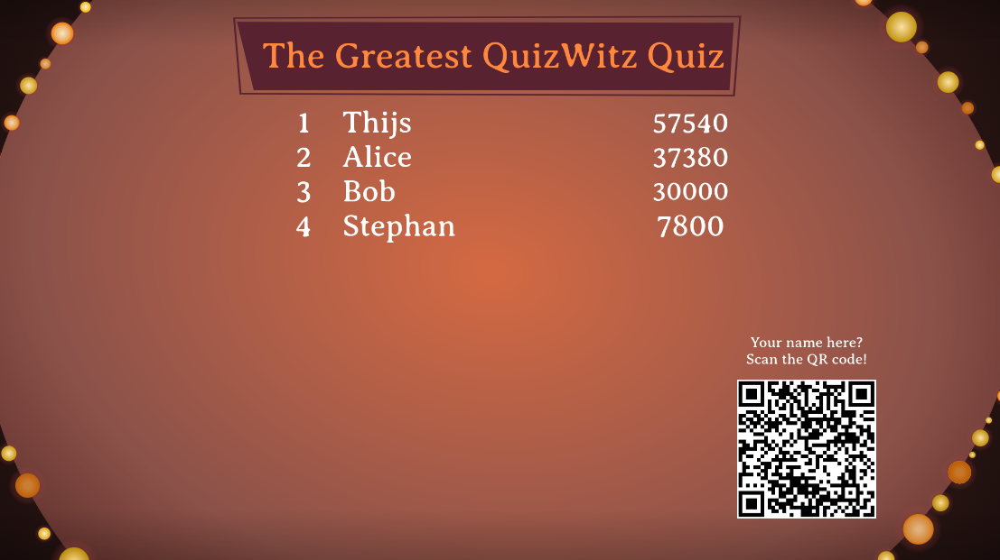
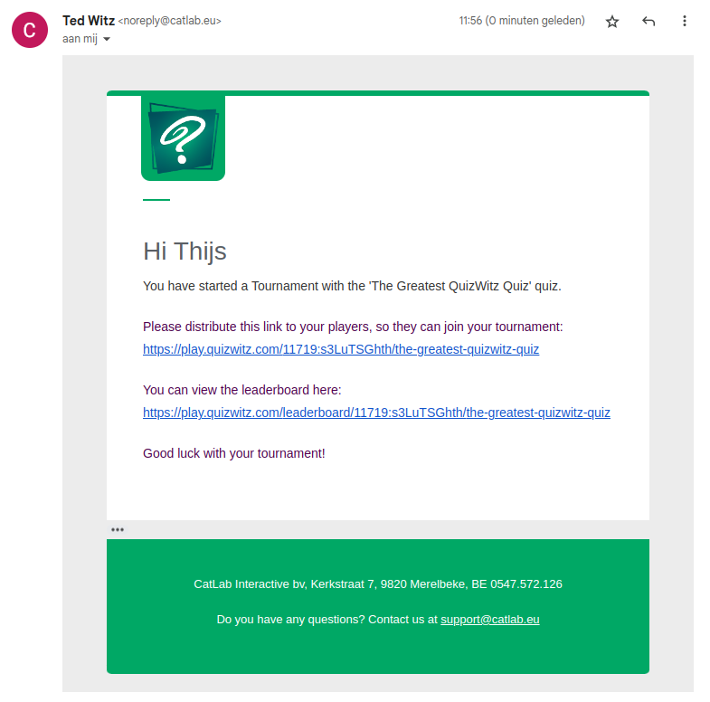

This tutorial will show you how to use QuizWitz Tournament mode. The Tournament mode allows players 
to play your quiz whenever they want on their own device. Their score is then recorded on a global leaderboard 
that can be displayed in your venue.

## Create the quiz
When creating the quiz, make sure the game is not too long. If visitors need to spend too much time on the quiz, 
they are likely not going to finish it. Only players who have actually finished the whole quiz will be displayed 
on the leaderboard.

### Random question selection
You may want to make the game select a random selection of questions from a pool of available questions. This way each 
player will have a unique quiz, and players who play multiple times will get unique questions each time. 

To make the game select random questions, you need to:

* Choose 'Quiz' in the 'Create' model and give your quiz a name. Make sure that the language is set correctly
* Create 3 rounds and give them a name (ie: Round 1, Round 2, Round 3)
* In the 'Round settings' (little cog icon on the right), set the 'Only show x questions' flag and set the amount of
  questions to 5. Also set the 'Random question order' flag, otherwise the game will always select the first 5 questions.
  Repeat this for every round in the quiz.

## Start the tournament
Tournaments can only be started from the "Advanced game options". Select "Play quiz" and choose "Advanced game options".

In the resulting popup, select the "Tournament" game mode and click the "Generate play link" button.

You will now receive two links:
 * Player link: this is the link that may be communicated to the players. This is not required, as that link 
is also available as a QR code on the leaderboard.
 * Leaderboard link: this link should be opened on a display in the venue. This will display the current player ranking,
in addition to a QR code that players can scan to play the game.

### Launching the leaderboard
In order to launch the leaderboard, you must login. Click "Login to add a profile" and enter your password. Your profile 
will then be added to the profile select window and you can click it to start the leaderboard.

Once the first results start coming in, player scores will be displayed on the leaderboard.

## Email
You will also receive an email with both the player- and the leaderboard link. This way you won't lose the links.

